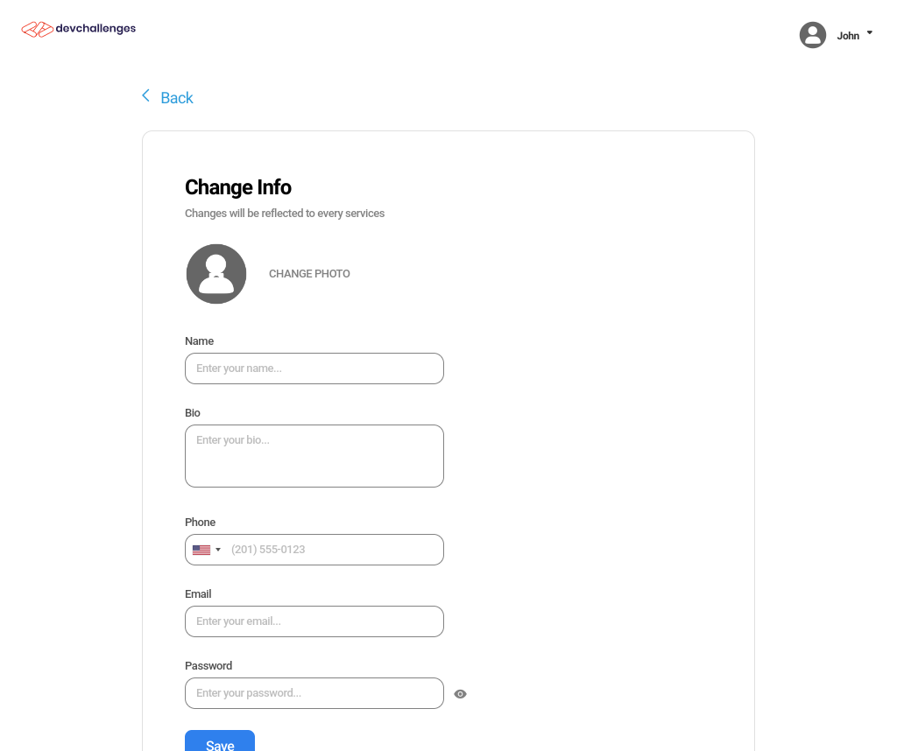

<h1 align="center">Authentication App</h1>

<div align="center">
   Solution for a challenge from  <a href="http://devchallenges.io" target="_blank">Devchallenges.io</a>.
</div>

<div align="center">
  <h3>
    <a href="https://authentication-app-473ad7.netlify.app">
      Solution
    </a>
    <span> | </span>
    <a href="https://devchallenges.io/challenges/N1fvBjQfhlkctmwj1tnw">
      Challenge
    </a>
  </h3>
</div>

[](https://app.netlify.com/sites/authentication-app-473ad7/deploys)

Visit [https://authentication-app-473ad7.netlify.app](https://authentication-app-473ad7.netlify.app).

## Features

This application/site was created as a submission to a [DevChallenges](https://devchallenges.io/challenges) challenge. The [challenge](https://devchallenges.io/challenges/N1fvBjQfhlkctmwj1tnw) was to build an application to complete the given user stories.

It features:

- Frontend deploy on Netlify and backend on Render
- Username/Password authentication
- Strong password enforcement
- OAuth authentication (GitHub and Google)
- `httpOnly` cookies for session management
- Client and server code are written in a modular and highly scalable way
- Profile images stored in Cloudinary
- Automatic dark mode
- Redis database for session storage
- Query and modify local Redis entries in real-time

**Note:** for the GitHub OAuth to work, third-party cookies must be enabled.

## Overview

### Signup (desktop, light theme)


### Login (desktop, dark theme)


### Welcome page (desktop, light theme)


### Profile (mobile, light theme)


### Profile edit (desktop, light theme)



## Getting started

After grabbing a local copy of the repository, you can start the backend server in development or production mode, by issuing either `npm run start:dev` or `npm run start` respectively, from inside `backend/` folder.

When using Redis database locally, the package `redis-commander` allows one to query and modify the entries in the database in real time.

Regarding the session, a secret must be provided to verify the authenticity of each user session (it's used to sign the session cookie).

The user data is stored in a Mongo database.

### Environment variables

The application expects certain environment variables (provided values are template examples):

```bash
PORT=5000

MONGODB_URL="mongodb+srv://xxxxxxxxxxxxxxxxxxxxxxxx"

# Redis configuration only needed in development mode
REDIS_HOST="localhost"
REDIS_PORT=6379

# Secret for signing the session cookie
SESSION_SECRET="xxxxxxxxxxxxxxxxxxxxxxxx"

# OAuth
# GitHub
GITHUB_CLIENT_ID="xxxxxxxxxxxxxxxxxxxxxxxx"
GITHUB_CLIENT_SECRET="xxxxxxxxxxxxxxxxxxxxxxxx"
# Google
GOOGLE_CLIENT_ID="xxxxxxxxxxxxxxxxxxxxxxxx"
GOOGLE_CLIENT_SECRET="xxxxxxxxxxxxxxxxxxxxxxxx"

CLOUDINARY_URL="cloudinary://xxxxxxxxxxxxxxxxxxxxxxxx"

FRONTEND_URL="http://xxxxxxxxxxxxxxxxxxxxxxxx"
```

## Built With

- [React](https://reactjs.org/)
- [Express](http://expressjs.com/)
- [Redis](https://redis.io/)
- [MongoDB](https://mongodb.com/)
